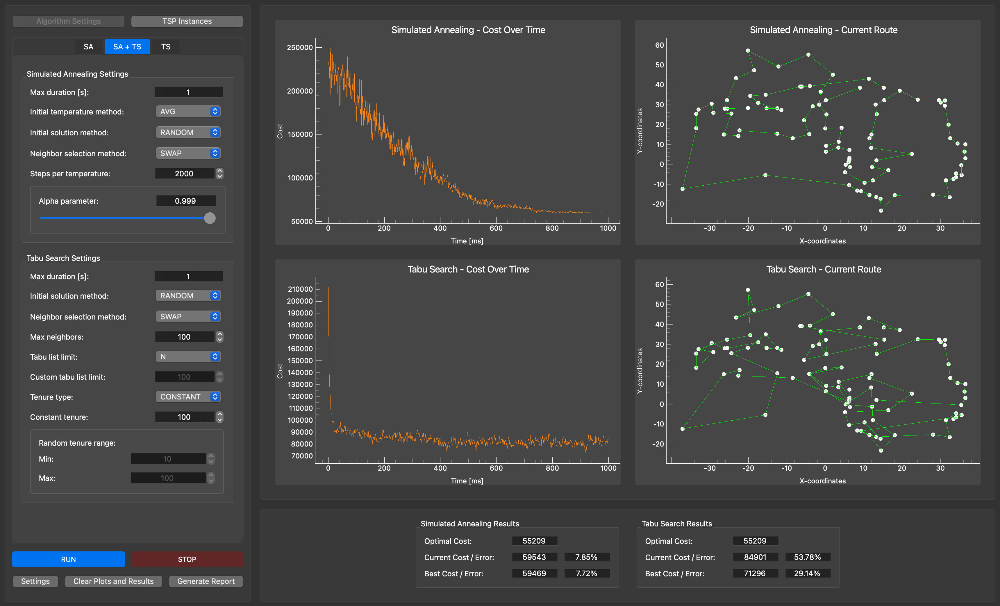

# Application for comparing simulated annealing and tabu search algorithms for the TSP problem

[](https://doi.org/10.5281/zenodo.16886919)

## About The Project
This project focuses on solving the **Travelling Salesman Problem (TSP)** using two metaheuristic algorithms: **Simulated Annealing (SA)** and **Tabu Search (TS)**. It includes a desktop application with a user-friendly graphical interface for configuring, running, and comparing these algorithms. Users can monitor results in real time and generate detailed reports after simulations.

Key features include:
- Loading and managing TSP instances from the [TSPLIB](http://comopt.ifi.uni-heidelberg.de/software/TSPLIB95/) library.
- Customizing algorithm parameters.
- Visualizing solutions and cost evolution in real time.
- Generating reports summarizing results.

## Application Interface


## Getting Started on macOS

### Prerequisites
- Ensure your system supports Python 3.11. If not, install it using Homebrew:
    ```bash
    brew install python@3.11
    ```
- Ensure your system has a C++ compiler supporting C++20. If not, install GCC:
    ```bash
    brew install gcc
    ```
- Install the required global libraries and tools:
    ```bash
    brew install nng
    brew install pybind11
    brew install pdflatex
    ```

### Installation  

1. Clone the repository:
   ```bash
   git clone https://github.com/jonasz-lazar-pwr/tsp-optimization-application.git
   cd tsp-optimization-application
    ```
2. Create a virtual environment for the project and install Python dependencies:
    ```bash
    python3 -m venv tsp-optimization-env
    source tsp-optimization-env/bin/activate
    pip install -r requirements.txt
    ```
3. Compile the C++ source code in Release mode using CMake:
    ```bash
    mkdir build
    cd build
    cmake -DCMAKE_BUILD_TYPE=Release ..
    make
    ```
4. Run the application:
    ```bash
    python src/main.py
    ```

## Author and License

This project was developed by **Jonasz Lazar** as part of his engineering thesis at the **Wrocław University of Science and Technology**.

- Thesis DOI: [10.5281/zenodo.16886710](https://doi.org/10.5281/zenodo.16886710)  
- Code DOI: [10.5281/zenodo.16886920](https://doi.org/10.5281/zenodo.16886920)  

Distributed under the **MIT License**.mFor more information, see the [LICENSE](LICENSE) file.
